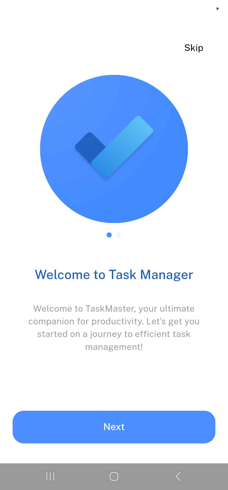
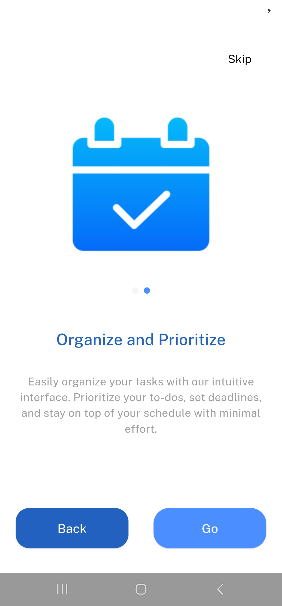
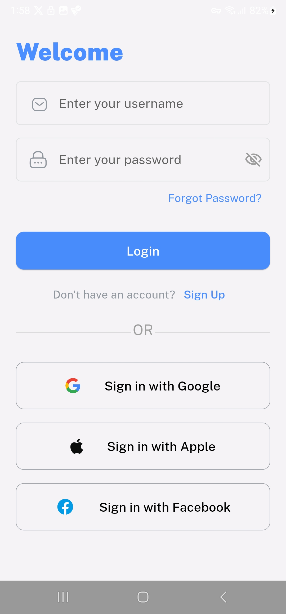
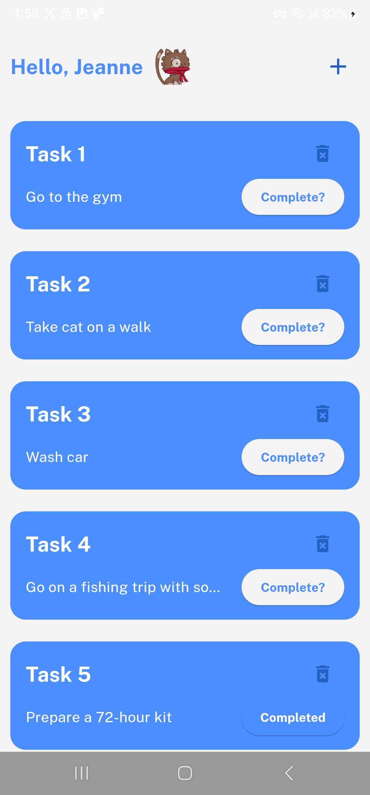
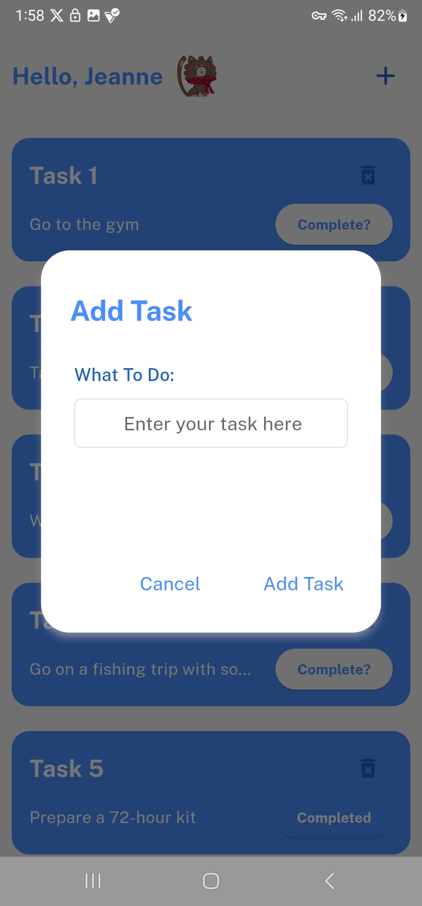

# 🔥🔥 Task Manager

A Task Manager app, created with Flutter 💻. It focuses on my coding skills and the structure of my projects.

## Getting Started

This Task Manager App where you can easily organize your tasks with our intuitive interface. Prioritize your to-dos, set deadlines, and stay on top of your schedule with minimal effort.

* Prerequisites
  
Flutter SDK: Ensure you have Flutter installed on your machine. Follow the official guide here if you haven't done so.

An IDE or code editor like VSCode, Android Studio, or IntelliJ IDEA.

Git: Installed and configured on your system.

* Installation Steps
Clone the Repository:
`git clone https://github.com/your-username/task_manager_app.git`

`cd task_manager_app`

Install Dependencies:

`flutter pub get`

Run the App:

`flutter run`

Star ⭐ the repo to support the project.

## Features

User Authentication

- Login to Account: Allow users to log in using their credentials.
  
Task Management

- Add Tasks: Provide functionality to add new tasks.
- View Tasks: Enable users to view a list of their tasks.
- Edit Tasks: Allow users to mark tasks as completed.
- Delete Tasks: Provide an option for users to delete tasks.

Data Storage

- Store Tasks Locally: Ensure tasks are stored locally so that users can access their data even when offline.

## Screenshots

  
   

   
  

   
  

## Tools

- Front-end: Dart - Flutter framework
- State Management: Bloc
- Data Networking: Dio package
- Local Storage: SQLlite

## Challenges Faced

- API limitations: The dummyjson API had some limitations in terms of available features. Had to implement workarounds for certain functionalities.
- State Management Complexity: Managing state transitions efficiently with Bloc required a careful design to avoid unnecessary rebuilds and ensure a smooth user experience.
- Performance Optimization: Ensured smooth UI interactions by optimizing state management and avoiding redundant network calls.

## Questions?🤔

Hit me on

## Contributing

Pull requests are welcome.
